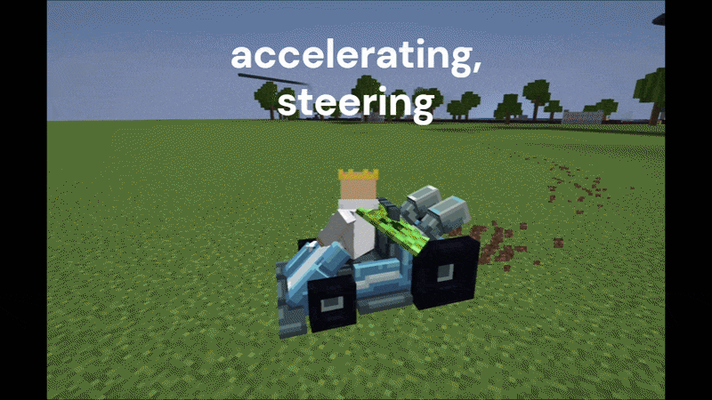

# Minecraft Go-Kart Project — 100% Vanilla

Mario Kart–style go-karting plugin for Paper 1.21, built with no client mod. Karts, drifting, and checkpoints are all done with horses, item displays, and packet-level input reading. Built for **Clobnet** (now shut down), archived here unfinished.

## How it works

- Kart = a `Horse` ridden by the player, skinned with `ItemDisplay` entities via `CustomModelData` on leather horse armor.
- Steering is read server-side through ProtocolLib's `STEER_VEHICLE` packet — no client plugin needed.
- Acceleration, braking, and drifting are custom physics applied to the horse's velocity each tick.
- Tracks/checkpoints are world coordinates stored per-world in config.

## Commands

| Command | Description |
|---|---|
| `/race <start\|stop> <track>` | Start/stop a race (`this` = current world). Op-only. |
| `/garage`, `/garage leave` | Enter/leave kart garage. |
| `/garage setspawn <vehicle\|player>` | Set garage spawn point. Op-only. |
| `/build menu` | Get track-piece build tool. Op-only. |
| `/racepos add racer <n>` | Set grid position `n`. Op-only. |
| `/racepos add finish` | Place finish line. Op-only. |
| `/racepos add checkpoint` | Add next checkpoint. Op-only. |
| `/racepos remove racer <n>` / `remove allracer` | Remove grid position(s). Op-only. |

## Requirements

- Paper 1.21.x (uses Paper-only APIs, not plain Spigot/Bukkit)
- [ProtocolLib](https://www.spigotmc.org/resources/protocollib.1997/) — required
- [ViaVersion](https://viaversion.com/) optional, to let newer clients join a 1.21 server
- A custom resource pack is optional, but recommended for better visuals. The plugin will work without it, but the default horse model will be used for karts.

## Known Issues

- One race at a time server-wide
- Restarting a race can compound steering values
- Jump pad / launch pad items are stubs; only speed boost item exists
- Garage kart customization + Mongo persistence are unfinished

## License

MIT — see [LICENSE](LICENSE).
